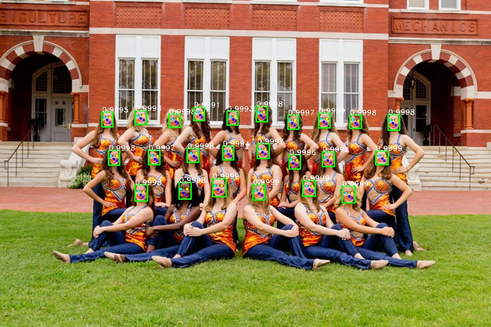

# [retinaface-tf2](https://github.com/peteryuX/retinaface-tf2)

[](https://lgtm.com/projects/g/peteryuX/retinaface-tf2/context:python)


[](https://colab.research.google.com/github/peteryuX/retinaface-tf2/blob/master/notebooks/colab-github-demo.ipynb)

:fire: RetinaFace (RetinaFace: Single-stage Dense Face Localisation in the Wild, published in 2019) implemented (ResNet50, MobileNetV2 trained on single GPU) in Tensorflow 2.0+. This is an unofficial implementation. :fire:

> RetinaFace presents a robust single-stage face detector, which performs pixel-wise face localisation on various scales of faces by taking advantages of joint extra-supervised and self-supervised multi-task learning(manually annotate five facial landmarks on the WIDER FACE). On the WIDER FACE hard test set, RetinaFace outperforms the state of the art average precision (AP) by 1.1% (achieving AP equal to 91.4%).

Original Paper: &nbsp; [Arxiv](https://arxiv.org/abs/1905.00641)

Offical Implementation: &nbsp; [MXNet](https://github.com/deepinsight/insightface/tree/master/RetinaFace)

:: Results from this reporepository. ::


****

## Contents
:bookmark_tabs:

* [Installation](#Installation)
* [Data Preparing](#Data-Preparing)
* [Training and Testing](#Training-and-Testing)
* [Benchmark](#Benchmark)
* [Models](#Models)
* [References](#References)

***

## Installation
:pizza:

Create a new python virtual environment by [Anaconda](https://www.anaconda.com/) or just use pip in your python environment and then clone this repository as following.

### Clone this repo
```bash
git clone https://github.com/peteryuX/retinaface-tf2.git
cd retinaface-tf2
```

### Conda
```bash
conda env create -f environment.yml
conda activate retinaface-tf2
```

### Pip

```bash
pip install -r requirements.txt
```

****

## Data Preparing
:beer:

**Step 1**: Download the [WIDER FACE](http://shuoyang1213.me/WIDERFACE/index.html) dataset images from the download links bellow.

| Dataset Name | Link |
|:------------:|:----------:|
| WIDER Face Training Images | [Google Drive](https://drive.google.com/file/d/0B6eKvaijfFUDQUUwd21EckhUbWs/view?usp=sharing) |
| WIDER Face Validation Images | [Google Drive](https://drive.google.com/file/d/0B6eKvaijfFUDd3dIRmpvSk8tLUk/view?usp=sharing) |

**Step 2**: Download the [Retinaface official annotations](https://github.com/deepinsight/insightface/tree/master/RetinaFace#Data) (face bounding boxes & five facial landmarks) from the download links bellow.

| Dataset Name | Link |
|:------------:|:----------:|
| Retinaface Annotations | [Google Drive](https://drive.google.com/file/d/1vgCABX1JI3NGBzsHxwBXlmRjaLV3NIsG/view?usp=sharing) / [Dropbox](https://www.dropbox.com/s/7j70r3eeepe4r2g/retinaface_gt_v1.1.zip?dl=0) |

**Step 3**: Extract downloaded files into `./data/widerface/`. The directory structure should be like bellow.
```
./data/widerface/
    train/
        images/
        label.txt
    val/
        images/
        label.txt
```

**Step 4**: Convert the training images and annotations to tfrecord file with the the script bellow.
```bash
# Binary Image (recommend): need additional space
python data/convert_train_tfrecord.py --output_path="./data/widerface_train_bin.tfrecord" --is_binary=True
# Online Image Loading:
python data/convert_train_tfrecord.py --output_path="./data/widerface_train.tfrecord" --is_binary=False
```

Note:
- You can run `python ./dataset_checker.py` to check if the dataloader work. Please modify the inside setting (in [./dataset_checker.py](https://github.com/peteryuX/retinaface-tf2/blob/master/dataset_checker.py)) for different situations.

****

## Training and Testing
:lollipop:

### Config File
You can modify your own dataset path or other settings of model in [./configs/*.yaml](https://github.com/peteryuX/retinaface-tf2/tree/master/configs) for training and testing, which like below.

```python
# general setting
batch_size: 8
input_size: 640
backbone_type: 'ResNet50'  # 'ResNet50', 'MobileNetV2'
sub_name: 'retinaface_res50'

# training dataset
dataset_path: './data/widerface_train_bin.tfrecord'
dataset_len: 12880  # number of training samples
using_bin: True
using_flip: True
using_distort: True

# testing dataset
testing_dataset_path: './data/widerface/val'

# network
out_channel: 256

# anchor setting
min_sizes: [[16, 32], [64, 128], [256, 512]]
steps: [8, 16, 32]
match_thresh: 0.45
ignore_thresh: 0.3
variances: [0.1, 0.2]
clip: False

# training setting
epoch: 100
init_lr: !!float 1e-2
lr_decay_epoch: [50, 68]
lr_rate: 0.1
warmup_epoch: 5
min_lr: !!float 1e-3

weights_decay: !!float 5e-4
momentum: 0.9

pretrain: True

save_steps: 2000
```

Note:
- The `sub_name` is the name of outputs directory used in checkpoints and logs folder. (make sure of setting it unique to other models)
- The `using_bin` is used to choose the type of training data, which should be according to the data type you created in the [Data-Preparing](#Data-Preparing).
- The `save_steps` is the number interval steps of saving checkpoint file.

### Training

Train the Retinaface model by yourself, or dowload it from [BenchmarkModels](#Models).
```bash
# train ResNet50 backbone model
python train.py --cfg_path="./configs/retinaface_res50.yaml" --gpu=0
# or train MobileNetV2 backbone model
python train.py --cfg_path="./configs/retinaface_mbv2.yaml" --gpu=0
```

Note:
- The `--gpu` is used to choose the id of your avaliable GPU devices with `CUDA_VISIBLE_DEVICES` system varaible.
- You can visualize the learning rate scheduling by running "`python ./modules/lr_scheduler.py`".

### Testing on [WIDER FACE](http://shuoyang1213.me/WIDERFACE/index.html) Validation Set

You can download my trained models for testing from [Models](#Models) without training it yourself. And, evaluate the models you got with the corresponding cfg file on the testing dataset.

**Step 1**: Produce txt results and visualizations from model.
```bash
# Test ResNet50 backbone model
python test.py --cfg_path="./configs/esrgan.yaml" --save_image=True
# or
# Test ResNet50 backbone model
python test.py --cfg_path="./configs/psnr.yaml" --save_image=True
```

Note:
- The visualizations results would be saved into `./results/`.

**Step 2**: Evaluate txt results. (Codes come from [Here](https://github.com/wondervictor/WiderFace-Evaluation))
```bash
cd ./widerface_evaluate
python setup.py build_ext --inplace
python evaluation.py
```

### Detect on Input Image

You can detect on your image by the model. For example, detect on the image from [./data/0_Parade_marchingband_1_149.jpg](https://github.com/peteryuX/retinaface-tf2/blob/master/data/0_Parade_marchingband_1_149.jpg) as following.

```bash
python test.py --cfg_path="./configs/retinaface_res50.yaml" --img_path="./data/0_Parade_marchingband_1_149.jpg" --down_scale_factor=1.0
# or
python test.py --cfg_path="./configs/retinaface_mbv2.yaml" --img_path="./data/0_Parade_marchingband_1_149.jpg" --down_scale_factor=1.0
```

Note:
- You can down scale your input by the `--down_scale_factor`.

### Demo on Webcam

Demo face detection on your webcam.
```bash
python test.py --cfg_path="./configs/retinaface_res50.yaml" --webcam=True --down_scale_factor=1.0
# or
python test.py --cfg_path="./configs/retinaface_mbv2.yaml" --webcam=True --down_scale_factor=1.0
```

****

## Benchmark
:coffee:

### WiderFace Validation Set Performance in single scale

| Model Name          | Easy   | Medium | Hard   |
|---------------------|--------|--------|--------|
| Tensorflow2 MobileNetV2 | 93.35% | 91.78% | 79.51% |
| Tensorflow2 ResNet50 | 94.84% | 93.95% | 83.38% |
| [Pytorch ResNet50](https://github.com/biubug6/Pytorch_Retinaface) | 95.48% | 94.04% | 84.43% |
| [Mxnet ResNet50 (Official)](https://github.com/deepinsight/insightface/tree/master/RetinaFace) | 94.97% | 93.89% | 82.27% |
****

Note:
- Tensorflow2 version (ResNet50/MobileNetV2) in this repository only trained with batch size (8/16) on single GPU.
- All models evaluate on original image scale.

## Models
:doughnut:

| Model Name          | Download Link |
|---------------------|---------------|
| Retinaface ResNet50 | [GoogleDrive](https://drive.google.com/file/d/1MgpOsJJRhm7tBDJ2lDlKyG3op7evivPd/view?usp=sharing) |
| Retinaface MobileNetV2 | [GoogleDrive](https://drive.google.com/file/d/1Q8b2vBLafFOr5hy5i4MbgOAoa9tppl3A/view?usp=sharing) |

Note:
- After dowloading these models, extract them into `./checkpoints` for restoring.
- All training settings of the models can be found in the corresponding [./configs/*.yaml](https://github.com/peteryuX/retinaface-tf2/tree/master/configs) files.

****

## References
:hamburger:

Thanks for these source codes porviding me with knowledges to complete this repository.

- https://github.com/deepinsight/insightface/tree/master/RetinaFace (Official)
    - Face Analysis Project on MXNet http://insightface.ai
- https://github.com/biubug6/Pytorch_Retinaface
    - Retinaface get 80.99% in widerface hard val using mobilenet0.25.
- https://github.com/wondervictor/WiderFace-Evaluation
    - Python Evaluation Code for Wider Face Dataset
- https://github.com/zzh8829/yolov3-tf2
    - YoloV3 Implemented in TensorFlow 2.0
